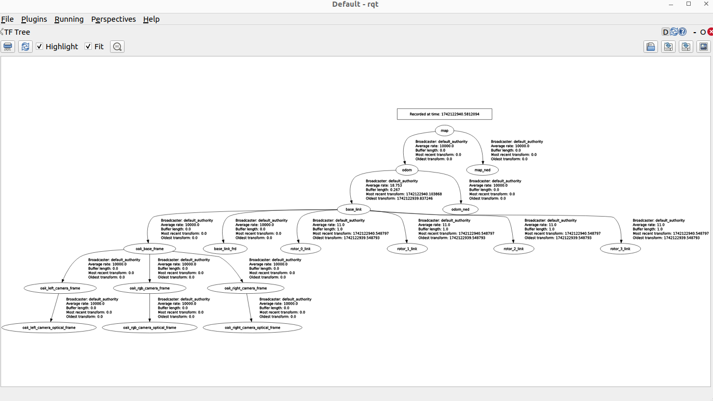
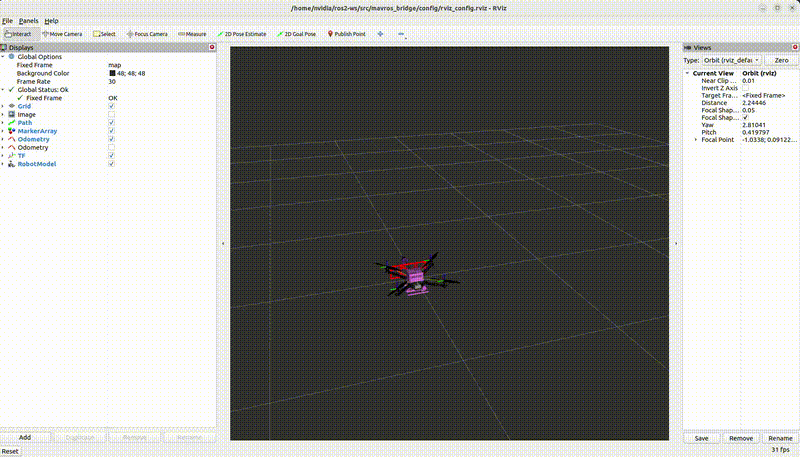

# Using OAK-D-Lite with PX4 IMU on Jetson Orin for Quadcopter

This repository integrates **VINS-GPU-ROS2** with PX4, featuring quality-of-life improvements such as Eigen optimizations, ROS 2 node adaptations, and additional configurable parameters. 

The **MAVROS bridge** launch file initializes all necessary nodes to operate the drone, we are using s500 dev kit.

---

## Build Instructions

### 1. Build OpenCV 4 with GPU Support

#### Clone OpenCV and OpenCV Contrib

```bash
mkdir -p ~/third_party
cd ~/third_party
git clone https://github.com/opencv/opencv.git
git clone https://github.com/opencv/opencv_contrib.git
cd opencv
git checkout 4.x  # Checkout latest stable version
cd ../opencv_contrib
git checkout 4.x
```

#### Configure and Compile OpenCV

```bash
cd ~/third_party/opencv
mkdir build && cd build
cmake -D CMAKE_BUILD_TYPE=Release \
      -D CMAKE_INSTALL_PREFIX=/usr/local \
      -D OPENCV_EXTRA_MODULES_PATH=~/third_party/opencv_contrib/modules \
      -D WITH_CUDA=ON \
      -D CUDA_ARCH_BIN=8.7 \
      -D CUDA_ARCH_PTX="" \
      -D WITH_CUDNN=ON \
      -D OPENCV_DNN_CUDA=ON \
      -D WITH_TBB=ON \
      -D WITH_V4L=ON \
      -D WITH_QT=OFF \
      -D WITH_OPENGL=ON \
      -D BUILD_EXAMPLES=OFF \
      -D BUILD_opencv_python3=ON \
      -D PYTHON3_EXECUTABLE=$(which python3) \
      -D PYTHON3_INCLUDE_DIR=$(python3 -c "from sysconfig import get_path; print(get_path('include'))") \
      -D PYTHON3_LIBRARY=$(python3 -c "import sysconfig; print(sysconfig.get_config_var('LIBDIR'))") \
      -D PYTHON3_PACKAGES_PATH=$(python3 -c "import sysconfig; print(sysconfig.get_path('purelib'))") ..
make -j$(nproc)
sudo make install
sudo ldconfig
```

### 2. Build Ceres Solver from Source

```bash
sudo apt-get install -y cmake libgoogle-glog-dev libatlas-base-dev libsuitesparse-dev
wget http://ceres-solver.org/ceres-solver-2.1.0.tar.gz
tar zxf ceres-solver-2.1.0.tar.gz
mkdir ceres-bin
mkdir solver && cd ceres-bin
cmake ../ceres-solver-2.1.0 -DEXPORT_BUILD_DIR=ON -DCMAKE_INSTALL_PREFIX="../solver"
make -j8  # Adjust for your CPU cores
make test
make install
```

**IMPORTANT:** Manually set the Ceres path in `CMakeLists.txt`:

```cmake
set(CERES_DIR "/home/nvidia/third_party/ceres/solver")
```

### 3. Build ROS 2 Packages

```bash
colcon build --symlink-install --base-paths src/vision_opencv --allow-overriding cv_bridge image_geometry
source install/setup.bash
```

```bash
rosdep install --from-path src/depthai-ros --ignore-src -y
colcon build --symlink-install --base-paths src/depthai-ros
colcon build --symlink-install --base-paths src/uosm_robot_viewer
colcon build --symlink-install --base-paths src/mavros_bridge
colcon build --symlink-install --base-paths src/VINS-Fusion-ROS2
```

---

## Running the System

### Running from a ROS 2 Bag File

#### 1. Record a ROS 2 Bag

```bash
source install/setup.bash
ros2 launch mavros_bridge record_oakdl_px4.launch.py
ros2 bag info dataset/oakd_px4
ros2 run vins vins_node
```

#### 2. Run Standalone VINS Node (No Loop Fusion)

**Terminal 1:**

```bash
ros2 launch vins vins_node
```

#### 3. Play the Recorded Bag File

**Terminal 2:**

```bash
ros2 bag play dataset/oakd_px4
```

### Running in Live Mode

```bash
source install/setup.bash
ros2 launch mavros_bridge oakdl_vins_mavros_bridge.launch.py
```

---
### TF Tree Representation


### RViz Visualization

---

